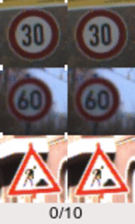
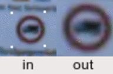
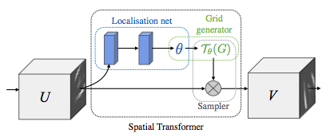

<link rel="stylesheet" type="text/css" media="all" href="custom.css"></link>

# Notes on Spatial Transformer Networks
> *New method for incorporating spatial attention in neural networks*

## Articles

- [Torch article 'The power of Spatial Transformer Networks'](http://torch.ch/blog/2015/09/07/spatial_transformers.html)
    - [my notes](#power-of-stns)
- [Deep Learning Paper Implementations: Spatial Transformer Networks - Part I](https://kevinzakka.github.io/2017/01/10/stn-part1/)
    - [my notes](#article-part-i-notes)
- [Deep Learning Paper Implementations: Spatial Transformer Networks - Part II](https://kevinzakka.github.io/2017/01/18/stn-part2/)
    - [my notes](#article-part-ii-notes)

## Power of STNs
- code examples are in Lua
- Main takeaway was that they were able to beat a really complicated model:

| Pipeline | IDSIA (2011) | Moodstocks (2015) | 
| ----------- | --- | -------- | 
| Augmentations | Yes | No |
| Jittering | Yes | No | 
| Network | ~90M weights | ~20M weights |
| Accuracy | **99.46%** | **99.61%** |
| Architecture/Ensemble | 25 networks | 1 network |
| Model | 3 CONV, 2 FC layers each | 3 CONV, 2 FC, 2 ST layers |

### About GTSRB dataset
- German Traffic Sign Recognition Benchmark (available [here](http://benchmark.ini.rub.de/?section=gtsrb&subsection=news))
- 43 categories | 39,209 train samples | 12,630 test ones

### GIFs
> The transformations can be easily visualized since the STN module is inserted right after the input layer and before the first hidden layer.

**Runtime visualization of transformations performed by STN**

- left : input image
- right : transformed image produced by the Spatial Transformer
- bottom : counter representing training steps (0 = before training, 10/10 = end of epoch 1)
- white dots : corners of the part of the image that is sampled

**Input with geometric noise**

- Input image contains scale and positional variability 
- Yet, Spatial Transformer's output remains almost static
- The transformer simplifies the task for the rest of the network as it learns to forward only the interesting part of the input and removes geometric noise

## **Article part I notes**

## **Article part II notes**

> Goal: a system robust to input variations like scale variation, viewpoint variation, deformation (*non rigid bodies can be deformed and twisted in unusual shapes*), etc. 

## A desirable system (note from [cs231n](http://cs231n.github.io/classification/)):
- A classification system must be invariant of the following variations in images, while retaining sensitivity to inter-class (inside one class) variations
    - **Viewpoint variation**; A single instance of an object can be oriented in many ways with respect to the camera.
    - **Scale variation**: Visual classes often exhibit variation in their size (size in the real world, not only in terms of their extent in the image).
    - **Deformation**: Many objects of interest are not rigid bodies and can be deformed in extreme ways.
    - **Occlusion**: The objects of interest can be occluded. Sometimes only a small portion of an object (as little as few pixels) could be visible.
    - **Illumination conditions**: The effects of illumination are drastic on the pixel level.
    - **Background clutter**: The objects of interest may blend into their environment, making them hard to identify.
    - **Intra-class variation**: The classes of interest can often be relatively broad, such as chair. There are many different types of these objects, each with their own appearance.

## *Some* spatial invariance of pooling layers
- CNNs add translation invariance (i know this)
- But how about other forms of invariance?
    - Pooling layer add limited spatial invariance:
    - Pooling is local and predefined
    - *The main takeaway is that ConvNets are not invariant to relatively large input distortions. This limitation is due to having only a restricted, pre-defined pooling mechanism for dealing with spatial variation of the data.*

## STNs

3 Defining properties of STNs:
- Modular: STNs can be inserted anywhere in existing architectures
- Differentiable: can be trained with backprop
- Dynamic: as opposed to pooling layers which are predefined, STNs perform active spatial transformations

*STN module*:

## Localization Net

> Learns and spits out parameters θ of affine transformation

Defined as follows:
- Input: feature map U of shape (H, W, C)
- Output: transformation matrix θ of shape (6,)
- Architecture: FCN or CNN

The localization network learns and outputs more an more accurate thetas

## Grid Generator

- First, creates normalized meshgrid of the same size as the input image U of shape (H, W). 
    - the meshgrid is a set of indices (x^t, y^t) that cover the whole input feature map (t for target coordinates in the output feature map).

> Don't really understand the sections *Parameterised Sampling Grid* and *Differentible Image Sampling* (will return to this after reading part 1)

# Resources

## Papers
- Original STN (*Jaderberg, Simonyan, Zisserman, Kavukcuoglu*)
    - [Spatial Transformer Networks](https://arxiv.org/abs/1506.02025)
    - [STN experiment videos](https://drive.google.com/file/d/0B1nQa_sA3W2iN3RQLXVFRkNXN0k/view)
- RNN-STN model 
    - [Recurrent Spatial Transformer networks](https://arxiv.org/abs/1509.05329)

## Code

1. [(Lasagne) Spatial transformer layer documentation](https://lasagne.readthedocs.io/en/latest/modules/layers/special.html#lasagne.layers.TransformerLayer)
1. [(Lasagne) github implementation](https://github.com/Lasagne/Lasagne/blob/master/lasagne/layers/special.py#L354-L440)
1. [(tensorflow) Spatial Transformer ](https://github.com/daviddao/spatial-transformer-tensorflow)
    - Uses [this @skaae code](https://github.com/skaae/transformer_network/blob/master/transformerlayer.py) as reference. Which is the same code as 2 (on lasagne github)
    - Local: `~/development/spatial-transformer-tensorflow`
1. [(Lasagne) static notebook example of using a transformer in a model](https://github.com/Lasagne/Recipes/blob/master/examples/spatial_transformer_network.ipynb)
1. [(Lasagne) Recurrent transformer implementation unofficial](https://github.com/skaae/recurrent-spatial-transformer-code)

* Lasagne uses Theano

# Other links I need to look at still
- https://pytorch.org/tutorials/intermediate/spatial_transformer_tutorial.html
- https://medium.com/@kushagrabh13/spatial-transformer-networks-ebc3cc1da52d
- https://medium.com/@shanlins/spatial-transformer-networks-stn-and-its-implementation-2638d58d41f8
- https://towardsdatascience.com/review-stn-spatial-transformer-network-image-classification-d3cbd98a70aa
